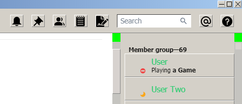
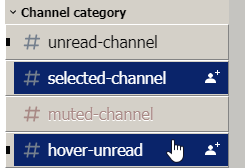
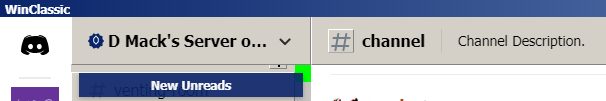

[dmackserv]: https://discord.gg/pB2SmhC
# WinClassic
## [Support Server][dmackserv] 
A BetterDiscord theme that imitates the appearance of the Windows Classic theme. 
 
This theme requires the Discord dark theme to be enabled in User Settings > Appearance (while in the Developer Preview phase) 
 
Some elements may be broken due to not being able to maintain or further develop this theme temporarily. 
 
(Developers only) Within the theme, there's instructions on how to mod WinClassic into the RealDark base, you can somewhat easily manually change the theme requirement to light theme by following step 1 and 4. 

